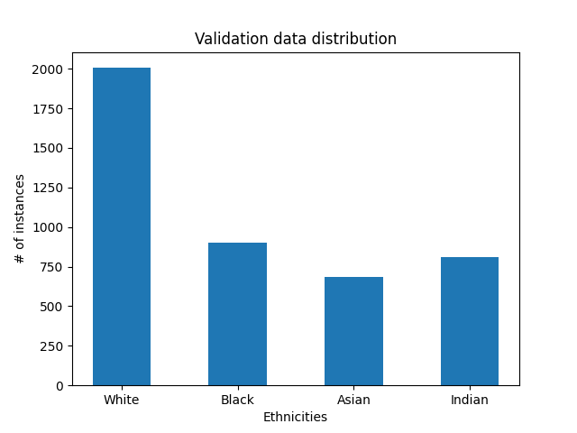
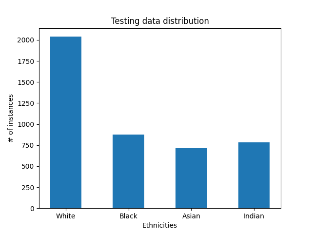
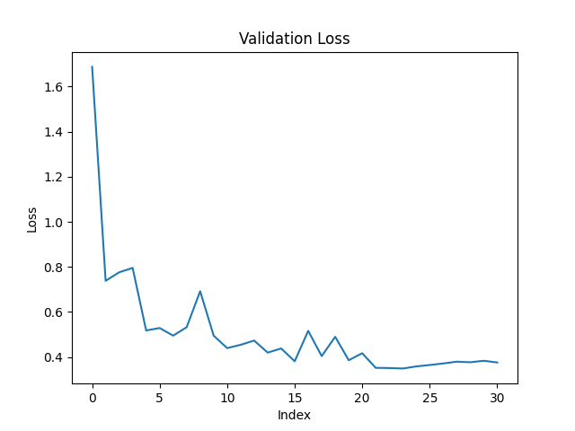
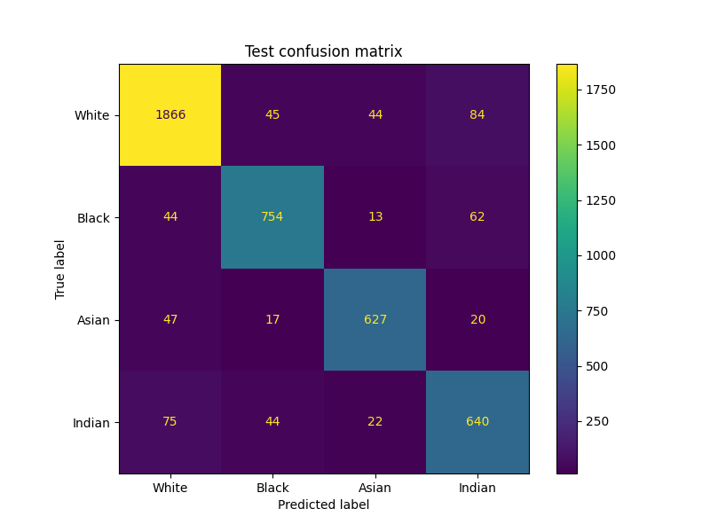
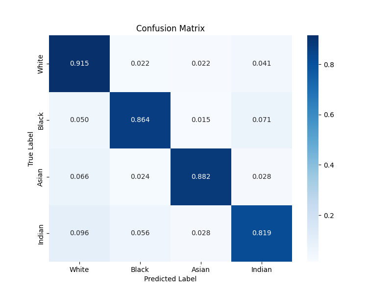

# EthnicityRecognition-UTKFaces

## Overview

EthnicityPredictor-UTK is a project focused on predicting ethnicities from images using PyTorch. The project utilizes the UTKfaces dataset, which contains a diverse collection of facial images annotated with age, gender, and ethnicity information.

## Features

- Ethnicity prediction from facial images.
- PyTorch-based implementation.
- Integration of ResNet architectures for effective feature extraction.
- Utilizes the UTKfaces dataset for training and evaluation.

## Getting Started

### Prerequisites

*TODO: The prerequisites for this project will be updated.*


### How to use

Follow these steps:

1. Clone the repository to your local machine:

    ```bash
    git clone https://github.com/anasserhussien/EthnicityRecognition-UTKFaces.git
    ```

2. Navigate to the project directory:

    ```bash
    cd EthnicityRecognition-UTKFaces
    ```

3. Execute the Python script to build the dataset:
    
    You can modify the CONSTANTS at the begin of the file if needed, the script will generate the `data/utk_races` dir which has the four ethnicities. The scrip will generate 3 splits train, val, and test based on the ratios defined in the CONSTANTS.

    ```bash
    python utk_dataset_builder.py
    ```
    Labels mapping:

        | Label | Ethnicity   |
        |-------|-------------|
        | 0     | White       |
        | 1     | Black       |
        | 2     | Asian       |
        | 3     | Indian      |

    Dataset distribution:
        <p float="left">
            
            
            
        </p>

4. Model training:

    ```bash
    python train.py
    ```


    Model Training Configurations:

        Maximum Epochs (MAX_EPOCHS): 30
        Batch Size (BATCH_SIZE): 64
        Learning Rate (LR): 0.001
        Optimizer: Adam
        Model Architecture: Non-pretrained ResNet-18
        Data splits:
            60% training
            20% validation
            20% testing 

5. Evaluation and Results:

    __Accuracy of the model on the test set: 88.261 %__
    
    The model is available under `/checkpoints` directory.

    <p float="left">
        
        
        
    </p>
